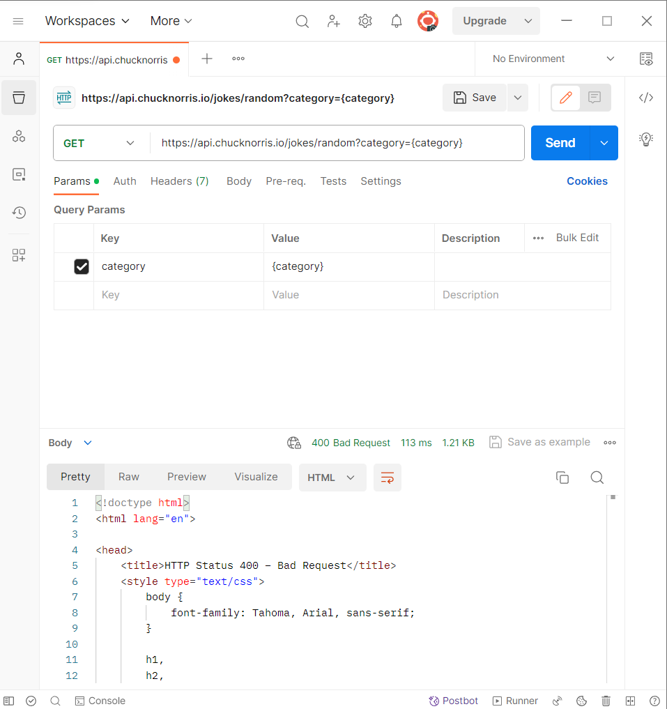
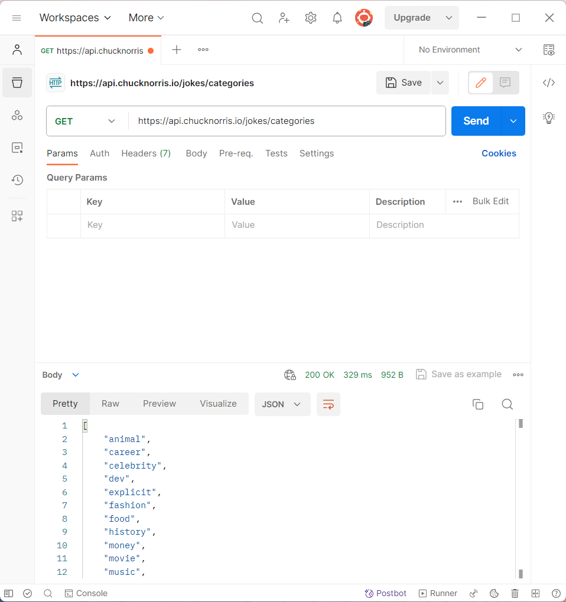
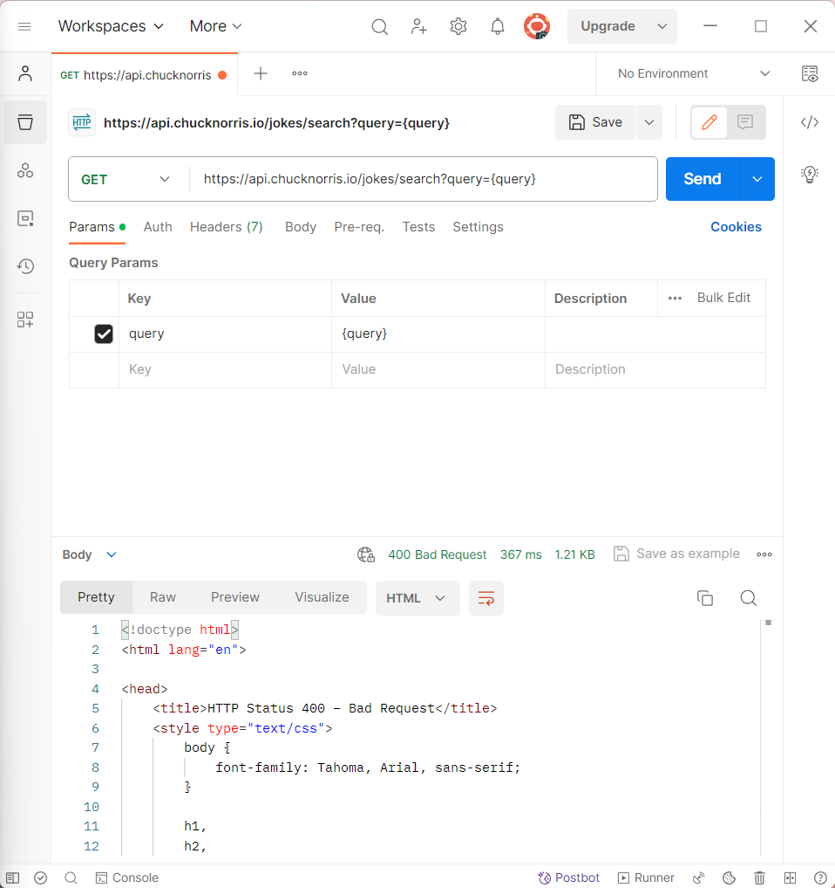

# **https://api.chucknorris.io/jokes/random?category={category}**

"The request cannot be fulfilled due to bad syntax.
". Parece que esta URL no funciona correctamente ni en la web.

---
---
# **https://api.chucknorris.io/jokes/categories**

Esta dirección me muestra todas las categorias de las bromas.

---
---
# **https://api.chucknorris.io/jokes/search?query={query}**

Aquí sucede lo mismo con el category={category}.