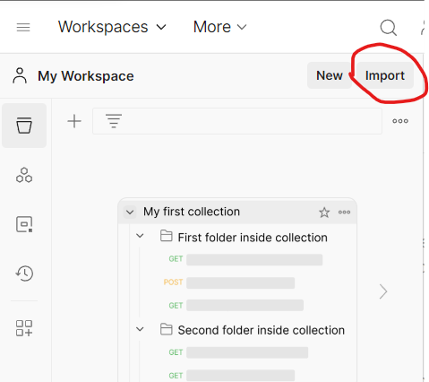
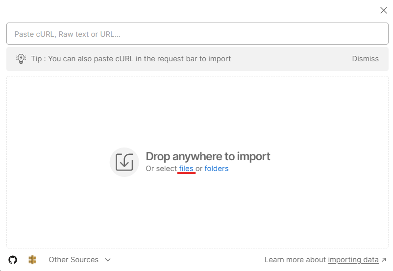
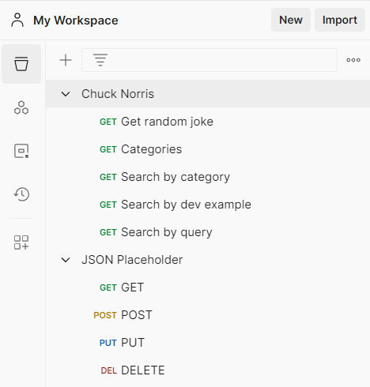

Para importar una colección, hay que seleccionar el botón "Import" dentro de "My Workspace".

---
Al clicar, se nos abrirá una ventana nueva donde podremos seleccionar la colección. En nuestro caso, lo haremos mediante un archivo.

---
Una vez seleccionada la colección, se nos mostrarán ya importadas en nuestro Workspace.

