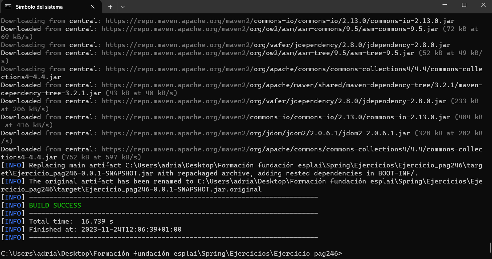
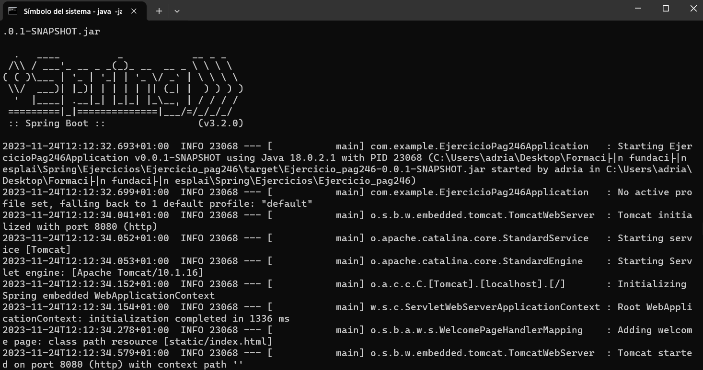

Primero tendremos que situarnos en el directorio raíz del proyecto. Una vez ahí, tendremos que ejecutar el comando "mvn clean package" para empaquetar la aplicación.

Al finalizar, la aplicación se quedará en un archivo JAR, y solo nos quedaría ejecutarla con el comando "java -jar target/{nombre}.jar", siendo {nombre} el nombre de la aplicación .jar.

